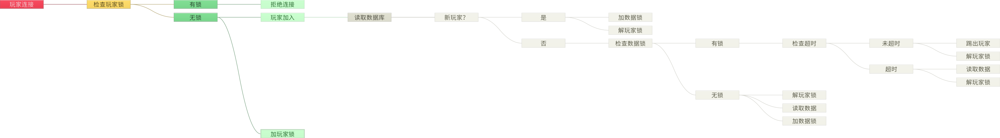

# PlayerZQL

I know it's a fork of caoli5288/PlayerSQL. But what are the differences between them?

PlayerZQL mainly has:
* Events and APIs for YOUR plugin to save YOUR data, into the database.
* Bungee/Non-Bungee modes, switchable. Non-Bungee mode is a mode which loads players' data on their     AsyncPlayerPreLoginEvent and provides better experience
* Better symbol names, comments, etc. :P

---
我知道这是个caoli5288/PlayerSQL的fork，但是它们有什么区别呢？

PlayerZQL主要有：

* 事件及API，供你把你插件中的数据存入数据库中
* Bungee/非Bungee模式可选。非Bungee模式可以在玩家的AsyncPlayerPreLoginEvent中读取数据，提供更好的用户体验。
* 更好的符号名称、注释等 :P

PlayerSQL
=========
允许你通过这个插件在不同的Minecraft服务器之间同步玩家数据。包括：
- 物品栏
- 装备栏
- 经验值
- 生命值
- 饥饿值
- 末影箱
- 药效果

事件管理器
--------
这个插件监听如下几个服务器事件：
- 玩家登录事件
- 玩家连接事件
- 玩家退出事件
- 玩家各种事件

请允许我懒得都列出来。

数据管理器
--------
服务端从1.8开始不允许异步操作玩家对象（简直是退步），因此所有有关玩家数据的读和写都必须在主线程完成。
数据管理器内含一个线程池用于调度jdbc连接，一个异步容器用于储存jdbc取到的数据，同时提供一个公共方法供轮讯任务使用，一个容器，记录被加锁玩家。

轮讯任务
------
基于同上的原因，需要调度一个在主线程运行的轮讯任务，将数据管理器读到的数据设置到玩家。数据成功设置后，为每个玩家调度一个定时保存任务。

玩家和数据锁
-----------
玩家在线（或者说连接）以后需要加锁，因为需要等待jdbc读取数据，玩家加锁期间无法进行一系列操作。同时由于蹦极的设定（先激活另一个服的连接，再断开当前服的连接），查询数据库的任务并非立即进行而是需要等待适当时间。

路径图
----

